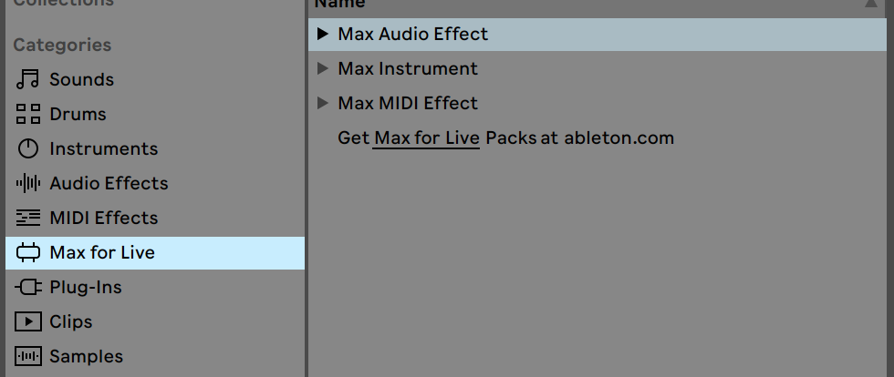

## Introduction
*note: Max For Live is not available in the Lite, Intro, and Standard Editions. You'll need Ableton Live Suite.*

This is a classic Digital Signal Processing (DSP) pack consists of audio effects plugins, such as Comb Filter, Distortion, Delay Line, FFT, and Ring Modulation that I created in Max MSP. Just like other VST plugins, in Ableton, those effects can be inserted into any audio and return tracks for sound design and music making purposes. 

### Download and Instruction
Once finish downloading the .zip file, the plugins should be ready to use by dragging into any of the tracks created in the Ableton session. 

For file management and navigation convenience, store these effects into your Ableton's User Library folder in your local disk. (Ableton/User Library/Presets/Audio Effects/Max Audio Effect)
This will make the devices show up here everytime Live is open and new session is created:

See the [manual](https://www.ableton.com/en/manual/max-for-live/) on the Ableton website for more information about Max for Live

### Notes
Some may have bugs, feel free to report any issues. 